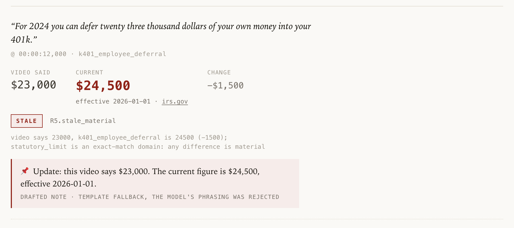

# Almanac

**Every gate in this gallery checks the video you're about to publish. Almanac checks the ones you already did.**

Almanac reads every number in a finance creator's back catalogue, resolves each one against a
sourced facts table, and drafts the "📌 Update" note for the videos that went stale. The model
reads. The code decides. Every verdict carries the rule that produced it.



<sub>A real row from `web/app.py`, rendered from `reports/latest.json`. Not a mock-up.</sub>

---

## Try it in 60 seconds

**Hosted — [almanac-gamma.vercel.app](https://almanac-gamma.vercel.app).** Open it and the last scan is already there: five videos, 83 verdicts, every one carrying the rule that produced it. Paste a script into the lint box and it reads it live. Nothing is scanned when the page loads.

Everything below runs the same engine locally.

```bash
git clone https://github.com/zaeem-rafiq/almanac.git && cd almanac
pip install -r requirements.txt
cp .env.example .env
python -m almanac lint corpus/scripts/fresh_wrong.md
```

That last line prints one `stale_material` row: the script says the IRA limit is `$7,000`, the
catalog says `$7,500`, and `R5.stale_material` is the rule that said so.

**One thing to fill in first.** Extraction calls `gemini-3.8-flash` on Vertex AI, so between
`cp` and `lint` you need a Google Cloud project with Vertex AI enabled in `.env`, and:

```bash
gcloud auth application-default login
```

No API key is stored for that path — it uses Application Default Credentials. `.env.example`
comments every variable, and there is no `ANTHROPIC_API_KEY` in it.

To see the reviewer page instead — a scan ships in the repo, so this needs nothing else:

```bash
python -m uvicorn web.app:app --port 8000
```

`reports/latest.json` is tracked (the nightly Action commits its own output), so the page has
verdicts on a fresh clone. `python -m almanac scan --source corpus` regenerates it.

---

## How it decides



Mermaid source: [`docs/architecture.mmd`](docs/architecture.mmd).

**The LLM labels what a sentence *is*. It never decides whether a number is wrong.** `extract.py`
and `notes.py` are the only modules that call a model. Every verdict comes from `judge.py`, which
calls no model at all and stamps each verdict with `rule_fired`.

### The rules, in execution order — ordering *is* the design

Rules run top to bottom and the first match wins. `rule_fired` values below are the literal strings
`judge.py` emits.

| # | `rule_fired` | verdict | what it catches |
|---|---|---|---|
| R1 | `R1.historical_matches_window` | `skip` | the speaker placed the claim in the past and the catalog's history window agrees — an accurate sentence |
| R1 | `R1.historical_disputed` | `unresolved` | a past-tense claim that misquotes its own era |
| R1 | `R1.historical_window_missing` | `unresolved` | no window covers that year. Missing evidence, **not** a contradiction |
| R2 | `R2.unjudged_claim_type` | `skip` | `illustrative`, `structural`, `other`, unkeyed `historical` — nothing to check against |
| R3 | `R3.no_entity_key` · `R3.no_claimed_value` · `R3.no_fact_value` | `unresolved` | a judged claim the catalog cannot resolve. Common and normal |
| R4 | `R4.matches_current` | `correct` | claimed == current, exactly |
| R5 | `R5.stale_material` · `R5.stale_immaterial` | stale | claimed != current. Materiality is decided by the rubric below |

R1 runs first on purpose. *"Back in 2022 it paid nine point six two percent"* is the loudest
divergence in the whole corpus against today's I-bond rate — and a completely accurate sentence. A
judge that reached R5 there would publish a confident false correction citing treasurydirect.gov,
which is the exact failure this product exists to prevent.

### The materiality rubric

Copied from the constants in [`almanac/judge.py`](almanac/judge.py), not written from memory.

| constant | value | what it means |
|---|---|---|
| `JUDGED_CLAIM_TYPES` | `statutory_limit`, `tax_bracket`, `market_rate` | the only claim types checked against facts. Everything else is skipped at R2 |
| `EXACT_MATCH_KINDS` | `statutory_limit`, `tax_bracket` | **any** difference is material. A viewer who contributes 23,000 when the limit is 24,500 contributes the wrong amount, and the size of the gap does not change that |
| `MARKET_RATE_MATERIAL_PP` | `0.50` | a `market_rate` must move at least 0.50 percentage points to be worth a correction. Rates drift; the video's argument survives a small move |

`kind` is read from `facts/catalog.yaml`, not from the model's `claim_type` — the code decides
which domain a fact lives in.

The bands overlap, which is why there is no single threshold. In the labelled set
`stale_material` spans −27.0%..−2.17% and `stale_immaterial` sits at +2.09%: 0.08 percentage
points apart. `kind` is what separates them. You can watch both fire on one file — in
`fresh_wrong.md` the IRA limit is wrong (`stale_material` — exact-match domain, so the size of the gap is irrelevant) and
the mortgage average is off by 0.14pp (`stale_immaterial`, under the 0.50 bar).

---

## Proof

Pasted verbatim from [`evals/results.md`](evals/results.md), which
`python -m almanac eval` writes. **54 labelled rows**, run **2026-09-08**.

<!-- BEGIN evals/results.md (verbatim; docs/proofs/A-10.md asserts byte equality) -->
# Almanac eval — extract + judge vs. the labelled set

`python -m almanac eval` · 2026-09-08 01:53 UTC

**GATE: PASS**

## Run

| | |
|---|---|
| sources read | 7 |
| verdicts produced | 111 |
| labelled rows | 54 |
| **rows matched** | **46 / 54** |
| labelled rows with no claim | 8 |
| labelled quotes absent from their source | 0 |
| verdicts with no labelled row | 65 |
| extraction | live |

Matching: a verdict's quote covers ≥ 0.90 of the labelled quote, greedy and one-to-one, ties broken by the tighter quote.

Coverage-floor sensitivity (matched rows): ≥0.50 → 52 · ≥0.70 → 48 · ≥0.90 → 46 · ≥1.00 → 46.
**The count moves inside the operating band (≥ 0.70) — the floor is load-bearing and the choice belongs in the ADR.**

## (a) Extraction recall

**85%** — 46 of 54 labelled claims were found by `extract.py`.

## (b) claim_type accuracy

**98%** — 45 of 46 matched rows carry the labelled type.

| expected \ got | `statutory_limit` | `market_rate` | `illustrative` | `historical` | `structural` | `other` | total |
|---|---|---|---|---|---|---|---|
| `statutory_limit` | 18 | · | · | · | · | · | 18 |
| `market_rate` | · | 4 | · | · | · | · | 4 |
| `illustrative` | · | · | 19 | · | · | 1 | 20 |
| `historical` | · | · | · | 1 | · | · | 1 |
| `structural` | · | · | · | · | 3 | · | 3 |
| `other` | · | · | · | · | · | · | 0 |

## (c) Per-status precision / recall

Recall counts **every labelled row of that status**, including rows extraction never produced a claim for — a missed stale sentence is a video that stays wrong. Precision is over matched rows only, since an unmatched verdict has no label to be scored against.

| status | precision | recall | TP | FP | FN | support | of which not extracted |
|---|---:|---:|---:|---:|---:|---:|---:|
| `skip` | 1.00 | 0.75 | 24 | 0 | 8 | 32 | 8 |
| `correct` | 1.00 | 1.00 | 9 | 0 | 0 | 9 | 0 |
| `stale_material` | 1.00 | 1.00 | 7 | 0 | 0 | 7 | 0 |
| `stale_immaterial` | 1.00 | 1.00 | 2 | 0 | 0 | 2 | 0 |
| `unresolved` | 1.00 | 1.00 | 4 | 0 | 0 | 4 | 0 |

| expected \ got | `skip` | `correct` | `stale_material` | `stale_immaterial` | `unresolved` | `<not extracted>` |
|---|---|---|---|---|---|---|
| `skip` | 24 | · | · | · | · | 8 |
| `correct` | · | 9 | · | · | · | · |
| `stale_material` | · | · | 7 | · | · | · |
| `stale_immaterial` | · | · | · | 2 | · | · |
| `unresolved` | · | · | · | · | 4 | · |

## (d) Hard negatives

**0 illustrative/historical row(s) wrongly flagged as stale** — out of 21 matched (of 28 labelled hard negatives). Ceiling 0.

Stale verdicts outside the labelled set: 0 (not gated — the issue defines the hard-negative count over labelled rows — but a rising number means the eval set has stopped covering what the pipeline emits).

## (e) Misses

0 status disagreement(s) on matched rows, plus 8 labelled row(s) extraction produced no claim for.

Labelled rows with no claim produced:

| line | expected | claim_type | quote |
|---|---|---|---|
| 7 | `skip` | `illustrative` | Six percent is four thousand two hundred dollars of your own money |
| 25 | `skip` | `illustrative` | Ten thousand dollars. It showed up, it is yours |
| 29 | `skip` | `illustrative` | Whatever is left goes into three funds. Not thirty. Three. |
| 30 | `skip` | `illustrative` | Say you go sixty forty, sixty percent stocks and forty percent bonds |
| 31 | `skip` | `illustrative` | Or eighty twenty if you are younger |
| 33 | `skip` | `illustrative` | Over thirty years, at that assumed rate, a lump sum roughly doubles a… |
| 39 | `skip` | `structural` | If you cash out before five years you give up three months of interest |
| 52 | `skip` | `illustrative` | Say you make $50,000 and your plan matches the first 5% |

### claim_type disagreements (status may still agree)

| line | expected | got | status | quote |
|---|---|---|---|---|
| 15 | `illustrative` | `other` | `skip` | Fifteen years of extra payments applied to the wrong bucket |
<!-- END evals/results.md -->

### Why not a regex

Three real sentences from `corpus/`, with the verdict Almanac actually produced.

| the sentence | what a regex sees | what Almanac does |
|---|---|---|
| *"For 2024 you can defer twenty three thousand dollars of your own money into your 401k."* <br><sub>`v1-401k-limits-explained`</sub> | **nothing.** There is no digit in the number. A `\$[\d,]+` pattern matches the year `2024` at best | reads it as `statutory_limit`, keys it to `k401_employee_deferral`, value `23000` → `R5.stale_material` against `24500` |
| *"If you assume a 10% return on that"* <br><sub>`corpus/scripts/fresh_wrong.md`</sub> | `10%` — a rate. Compared against any rates table it looks wrong, and a regex-based checker corrects it | labels it `illustrative` → `R2.unjudged_claim_type` → `skip`. It is an assumption, not a claim about the world |
| *"Back in 2022 it paid nine point six two percent"* <br><sub>`v5-ibonds-vs-high-yield-savings`</sub> | a percentage that is wildly off today's I-bond rate — the single loudest false positive available | R1 resolves it against the **2022 window**, finds 9.62, returns `skip`: *"accurate as stated"* |

The middle and bottom rows are the product. Anything can find a stale number; not flagging the
28 hard negatives is the hard part, and the table above measures it at **0** false positives.

---

## What's honest

* **The write-back appends, it does not pin.** There is no pin-a-comment API, so an approved note
  is added to the end of the video's description. `compose_description()` in `web/app.py` builds
  the exact text and a unified diff; a human reads the diff and decides. The reviewer page
  approves nothing on its own.
* **The write guard is three conditions, not one.** `videos.update` runs only when
  `ALMANAC_WRITE=true` **and** the target channel equals `ALMANAC_TEST_CHANNEL_ID` **and** the CLI
  was given `--apply`. Anything else prints the diff and exits. The web layer has no `--apply` and
  never constructs a YouTube client.
* **The nightly Action is wired but has not run yet.** `.github/workflows/nightly.yml` is a real
  job on a `0 7 * * *` schedule that refreshes the rates, scans, and commits its own report — no
  longer the manual-dispatch no-op it was before [#6](https://github.com/zaeem-rafiq/almanac/pull/6).
  It is nightly and no more often on purpose: `captions.download` costs 200 quota units per video,
  so a five-video YouTube scan is about 1,250 against a 10,000/day budget. As of this writing it has
  **zero runs** — the schedule is set, the evidence that it works on a runner is not in yet.
* **The manual facts change about once a year, and they are tested for it.** Every `source: manual`
  entry in `facts/catalog.yaml` is human-supplied with an IRS/SSA/TreasuryDirect URL — the agent
  may scaffold a row, it may not fill a value. `catalog.py` carries `MANUAL_MAX_AGE_DAYS = 395`,
  and an entry past it is reported stale rather than quietly served.
* **The market rates are read from the primary feeds directly, and no key is needed for them.**
  Each of the four has its own fetcher in `catalog.FETCHERS` — NY Fed for the effective fed funds
  rate, Freddie Mac's PMMS history for the 30-year fixed, Treasury's daily par yield for the
  10-year, BLS for CPI — and every row in `facts/rates.json` records which fetcher produced it
  alongside the primary-source URL it mirrors. `catalog.refresh_rates()` is the only function in
  the repo that reaches the network for a rate; everything else reads the written table. A fetcher
  that fails leaves the previous value intact and is reported, so a network blip cannot blank a
  good number. There is no FRED call here, and **no FMP call either** — FMP's `economic-indicators`
  returns a ~9-month-old window and cannot produce `cpi_yoy` at all, so ADR-000 §9 replaced it with
  these four.
* **Extraction repeats, measured rather than promised.** 9 gate runs across two measured states of
  `extract.py`, byte-identical **within each state** — 6 before the D-2 same-sentence guard and 3
  with it. The two blocks are deliberately not pooled: the guard changed what counts as a claim
  (115 verdicts → 111, matched holding at 46 of 54). It is a measurement over one corpus, one
  region and one model version, not a vendor guarantee.
* **Extraction misses 8 of 54 labelled rows.** All 8 are `skip` rows — illustrative or structural
  sentences that were never going to be corrected — so the miss costs coverage, not safety. It is
  still a miss, and `evals/results.md` lists every one by line number.
* **Finance is the wedge, not the ceiling.** Statutory limits and market rates are where numbers
  expire on a schedule and where being wrong costs a viewer money. Nothing in `judge.py` is
  finance-specific: it compares a claimed value to a sourced current value by `kind`. Any video
  with numbers that expire is the same problem.

---

## Stack

| | |
|---|---|
| language | Python 3.12 |
| extraction + note drafting | **`gemini-3.8-flash` on Google Vertex AI** (`google-genai`), `temperature=0.0` and a pinned seed. **Not Anthropic** — that path was retired at `038dbe6` and no module imports it |
| video I/O | YouTube Data API v3, owner OAuth (`google-api-python-client`). Never `yt-dlp`, never HTML scraping |
| market rates | four keyless primary feeds — NY Fed · Freddie Mac · Treasury · BLS — → `facts/rates.json`, each row recording its fetcher and source URL |
| decisions | plain Python in `almanac/judge.py`. No model, no framework |
| reviewer page | FastAPI + `uvicorn`, one static page, read-only |
| tests | `pytest` — `pytest tests/ -q` |

Exact pins in [`requirements.txt`](requirements.txt) — that file is the **runtime** set the host
and the nightly job install, so `pytest` is deliberately not in it; install it separately to run the
suite. How each API signature was verified is in
[`docs/decisions/ADR-000-stack.md`](docs/decisions/ADR-000-stack.md).

| Path | Role |
|---|---|
| `almanac/` | `cli` `catalog` `extract` `judge` `notes` `report` `youtube` `models` `evaluate` |
| `facts/catalog.yaml` | sourced facts; `manual` entries are human-supplied with a primary-source URL |
| `facts/rates.json` | the rates table, written by `rates --refresh` |
| `corpus/` | the synthetic channel and scripts the demo runs on |
| `evals/claims.jsonl` | the human-labelled set |
| `web/` | the reviewer page |
| `docs/{plans,proofs,blockers,decisions,walkthroughs}/` | plans, per-issue proof, blockers, ADRs |

## License

MIT — see [`LICENSE`](LICENSE).
