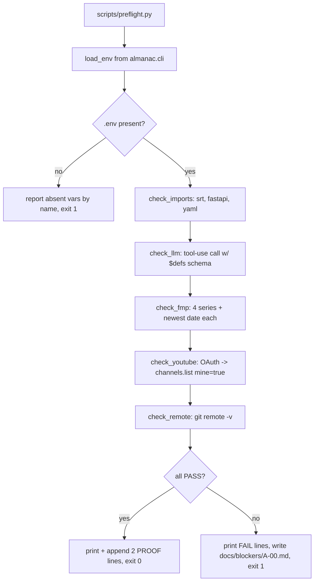

# feat: Almanac repo scaffold and A-00 pre-flight

## Goal Capsule

Stand up the `almanac` repo skeleton and a single executable gate — `scripts/preflight.py` —
that proves every external dependency Almanac needs is reachable and correctly configured
**before** any feature issue (A-01+) is allowed to start. The gate exits 0 and prints one
PASS line per check; the issue is done only when both PROOF lines read PASS.

Scaffold work needs no secrets and is sequenced first, so it proceeds while Zaeem provisions
keys. The pre-flight checks are sequenced last and are gated on those credentials.

---

## Problem Frame

Almanac's whole claim is *the LLM reads, the code decides* — a verdict is only trustworthy if
the facts behind it are real. That makes the credential and API surface load-bearing, not
incidental: a silently-wrong FMP field, an expired OAuth token, or a model that rejects the
tool schema all produce a confident, wrong "📌 Update" note. With a hard deadline of Tue Sep 8
07:00 America/Chicago, discovering any of those on Monday night is fatal.

A-00 buys certainty on day zero. Every later issue may assume the four surfaces below work,
because A-00 proved it and appended the evidence to `docs/proofs/A-00.md`.

**Already complete** (bootstrap steps 1-2, not re-planned here):
`.agents/rules/almanac.md` (verbatim, `trigger: always_on`); Python 3.12.12 venv at `venv/`
with all ten approved packages; `docs/decisions/ADR-000-stack.md` recording verified call
signatures and gaps G-1..G-5; `git init` on `main` plus `.gitignore`.

---

## Requirements

| ID | Requirement | Source |
|---|---|---|
| R1 | Repo contains the prescribed layout: `almanac/` package modules, `facts/`, `corpus/`, `evals/`, `web/`, `scripts/`, `reports/`, `.github/workflows/`, `docs/{proofs,blockers,decisions}/` | A-00 §1 |
| R2 | `LICENSE` (MIT) and a `README.md` stub exist | A-00 §1 |
| R3 | `.agents/rules/almanac.md` carries `trigger: always_on` and the Project Rules verbatim | A-00 §1 — **done in bootstrap** |
| R4 | `docs/decisions/ADR-000-stack.md` records versions, verified signatures, doc sources, and gaps | A-00 §1 — **done in bootstrap** |
| R5 | `python scripts/preflight.py` exits 0 with one PASS line per check | A-00 §1 |
| R6 | Anthropic call to `$LLM_MODEL` returns text | A-00 §1 |
| R7 | FMP returns ≥1 row for `economics-indicators?name=federalFunds`, `name=30YearFixedRateMortgageAverage`, `name=CPI`, and `treasury-rates` | A-00 §1 |
| R8 | YouTube OAuth completes and `channels.list(mine=true)` returns id == `$ALMANAC_TEST_CHANNEL_ID` | A-00 §1 |
| R9 | `python -c "import srt, fastapi, yaml"` succeeds | A-00 §1 |
| R10 | `git remote -v` shows the public GitHub repo | A-00 §1 |
| R11 | Both PROOF lines print to the transcript **and** append to `docs/proofs/A-00.md` | A-00 §2 |
| R12 | Secrets are read only from `.env`; no secret is ever printed — prefix check only | Project Rules |
| R13 | `facts/catalog.yaml` is scaffolded with `value: null` entries only; the agent fills no value | Project Rules |

---

## Key Technical Decisions

**KTD1 — The `.env` reader lives in `almanac/cli.py`, hand-rolled.**
`python-dotenv` is not in the approved package list and the rules forbid new dependencies
without approval (gap G-5). `cli.py` is the configuration entry point, so `load_env()` belongs
there rather than duplicated in each script. `scripts/preflight.py` imports it, which has the
useful side effect of proving the package is importable as part of the gate.
*Alternative rejected:* a private copy inside `preflight.py` — self-contained, but guarantees
drift between the gate's view of config and the runtime's.

**KTD2 — The Anthropic check is a tool-use call, not a plain completion.**
R6 only asks that the model return text. Making the check a tool-use call whose `input_schema`
is `model_json_schema()` output containing `$defs`/`$ref` satisfies R6 *and* closes gap G-3 —
whether the API accepts Pydantic's nested-model schema form. `extract.py` (A-03/A-04) depends
on exactly this shape; discovering a rejection then, rather than now, costs a re-plan under
deadline. Cost is one cheap call.

**KTD3 — FMP checks report freshness, and `max_age_days` is derived, not assumed.**
ADR §5b records three of four series observed roughly nine months stale (`federalFunds`,
`CPI`, `30YearFixedRateMortgageAverage` at 2025-12-xx) while `treasury-rates` was current
(2026-09-04). If that lag is also present on the REST endpoint, a naive freshness rule marks
Almanac's own rates table stale on day one and the demo contradicts itself on stage. Preflight
therefore prints the newest `date` per series. Setting per-series `max_age_days` from observed
cadence is **A-01 work**, not A-00 — A-00 only surfaces the number.

**KTD4 — OAuth uses `InstalledAppFlow`, caching to `token.json`.**
Scope `https://www.googleapis.com/auth/youtube.force-ssl` (confirmed present in the discovery
document, ADR §3). `token.json` is gitignored. Testing-mode refresh tokens expire after 7 days;
the authorisation date is appended to ADR-000 §7 on success, and one consent covers the Sep 8
deadline.

**KTD5 — Secret handling: prefix check only.**
Preflight prints `ANTHROPIC_API_KEY: sk-ant-…(len 108)` — a fixed short prefix and a length,
never the value, and never the tail. A missing variable is reported by name as absent.

**KTD6 — `videos.update` is read-modify-write (recorded, not built here).**
ADR §3a: `videos.update` is a PUT and a partial `snippet` drops omitted fields. A-07 must
`videos().list(part="snippet")` first, mutate only `description`, and send the whole snippet
back. Captured now so the constraint is not rediscovered under deadline; **no write path is
built in A-00**.

**KTD7 — Scaffold files are stubs that import cleanly and do nothing else.**
Each `almanac/*.py` module gets a docstring stating its role and its rule-bound constraint
(e.g. `judge.py`: "every verdict carries `rule_fired`"; `youtube.py`: the three write guards).
This makes the architecture legible in the repo from commit one and gives later issues a
landing place, without smuggling in unplanned logic.

---

## High-Level Technical Design

The gate is a linear sequence of independent checks; one failure does not abort the rest, so a
single run reports every problem at once rather than one per iteration.



Each `check_*` returns `(name, ok: bool, detail: str)`. The runner collects all results, prints
one line each, and derives the exit code and the composite PROOF line from the collection.

---

## Output Structure

```
almanac/
├── almanac/              # package — stubs only in A-00
│   ├── __init__.py
│   ├── cli.py            # entry point + load_env()  (KTD1)
│   ├── catalog.py        # only module permitted to call FMP
│   ├── extract.py        # calls a model — reads, never decides
│   ├── judge.py          # rules R1-R5, every verdict carries rule_fired
│   ├── notes.py          # calls a model — drafts the 📌 Update note
│   ├── report.py
│   ├── youtube.py        # three write guards live here
│   └── models.py         # protected after A-03
├── facts/
│   ├── catalog.yaml      # value: null entries only  (R13)
│   └── rates.json        # {} skeleton
├── corpus/
│   ├── channel/.gitkeep
│   └── scripts/{fresh_ok.md, fresh_wrong.md}
├── evals/claims.jsonl    # empty; Zaeem labels in A-02
├── web/{app.py, static/index.html}
├── scripts/{preflight.py, reset_demo.py, seed_channel.md}
├── reports/{latest.json, .gitkeep}
├── tests/test_preflight.py
├── .github/workflows/{nightly.yml, keepalive.yml}
├── docs/{proofs,blockers,decisions,plans}/
├── .agents/rules/almanac.md      ✅ done
├── LICENSE  README.md  .gitignore ✅
└── venv/                          ✅ gitignored
```

---

## Implementation Units

### U1. Repo scaffold — directories, licence, module stubs

**Goal:** The prescribed layout exists and the package imports cleanly.
**Requirements:** R1, R2
**Dependencies:** none — needs no secrets, start here.
**Files:** `LICENSE`, `README.md`, `almanac/__init__.py`, `almanac/{cli,catalog,extract,judge,notes,report,youtube,models}.py`, `corpus/channel/.gitkeep`, `corpus/scripts/{fresh_ok.md,fresh_wrong.md}`, `evals/claims.jsonl`, `web/app.py`, `web/static/index.html`, `scripts/{reset_demo.py,seed_channel.md}`, `reports/.gitkeep`, `.github/workflows/{nightly.yml,keepalive.yml}`
**Approach:** MIT licence, copyright Zaeem Khan, 2026. Each module stub is a docstring naming
its role and the rule that constrains it (KTD7) — no logic. Workflow files are commented
skeletons with `on: workflow_dispatch` only, so nothing fires until A-10/A-11 fill them.
`corpus/scripts/fresh_ok.md` and `fresh_wrong.md` are empty placeholders; their content is
A-04 work.
**Execution note:** Structural scaffolding — verify by import and file listing, not unit tests.
**Test scenarios:** `Test expectation: none — scaffolding only, no behavior.`
**Verification:** every path in the Output Structure tree exists; `venv/bin/python -c "import almanac, almanac.cli, almanac.judge, almanac.youtube"` succeeds.

### U2. Facts scaffold — `catalog.yaml` with null values, `rates.json` skeleton

**Goal:** The facts layer exists with its schema visible and **no fabricated values**.
**Requirements:** R1, R13
**Dependencies:** U1
**Files:** `facts/catalog.yaml`, `facts/rates.json`, `tests/test_catalog_scaffold.py`
**Approach:** `catalog.yaml` holds an `entities:` list. Every entry carries the full key set —
`key, label, kind, source, value, unit, effective_from, effective_to, source_url, max_age_days`
— with **`value: null` and `source_url: null` on every `source: manual` entry**. Scaffold the
`source: rates` entries for the four market series (`fed_funds`, `mortgage_30y`, `cpi`,
`treasury_10y`) with `value: null` too; `rates --refresh` populates them in A-01.
`rates.json` is `{}`. The agent fills nothing — Zaeem supplies manual values with
irs.gov / ssa.gov / treasurydirect.gov URLs in A-01, and the file becomes protected then.
**Patterns to follow:** the entity key set is fixed by the Project Rules; do not add fields.
**Test scenarios:**
- `catalog.yaml` parses as valid YAML and every entity has all ten keys present.
- Every entity whose `source` is `manual` has `value` exactly `None` — asserts the agent did
  not fill a value. (This test is expected to *pass* now and to be replaced in A-01 by its
  inverse, which fails on nulls.)
- `source` is one of `{manual, rates}` for every entity; no third value.
- `rates.json` parses as JSON and is an empty object.
**Verification:** `venv/bin/pytest tests/test_catalog_scaffold.py -q` passes.

### U3. Pre-flight harness — `.env` loader, check runner, proof emission

**Goal:** A runnable gate that loads config safely, runs checks, and writes proofs — with the
two credential-free checks (R9, R10) already wired.
**Requirements:** R5, R9, R10, R11, R12
**Dependencies:** U1
**Files:** `almanac/cli.py`, `scripts/preflight.py`, `tests/test_preflight.py`
**Approach:** `load_env(path=".env") -> dict[str, str]` in `cli.py` (KTD1): reads the file if
present, skips blank lines and `#` comments, splits on the **first** `=` only, strips
surrounding single/double quotes, and does **not** overwrite a variable already set in the
process environment (so CI secrets win over a local file). `mask(value)` returns
`"<first 6 chars>…(len N)"`, or `"ABSENT"` when unset (KTD5).
`preflight.py` defines `check_*() -> tuple[str, bool, str]`, runs all of them, collects
results, prints `PASS`/`FAIL` per check, appends the two PROOF lines to `docs/proofs/A-00.md`,
and exits 0 only when every check passed. **No check aborts the run** — one pass reports every
problem. `check_imports` imports `srt, fastapi, yaml`; `check_remote` shells `git remote -v`
and asserts a non-empty `origin` pointing at github.com.
The rules-file proof (`trigger: always_on` + the literal string `The LLM never decides`) is a
pure file read with no credential, so it is emitted here.
**Execution note:** The `.env` parser is real logic and gets unit tests; the network checks are
proven by running the gate, not by mocking it.
**Test scenarios:**
- `load_env` on a file with `A=1`, a blank line, a `# comment`, and `B = two words` returns
  `{"A": "1", "B": "two words"}`.
- A value containing `=` (e.g. `TOKEN=ab=cd`) splits on the first `=` only, yielding `ab=cd`.
- Quoted values `C="x"` and `D='y'` are unquoted to `x` and `y`.
- A variable already present in `os.environ` is **not** overwritten by the file.
- A missing `.env` file returns `{}` rather than raising.
- `mask("sk-ant-abcdefghij")` contains neither the full value nor its last characters, and
  reports the length; `mask(None)` returns `"ABSENT"`.
- The runner exits 1 and prints a FAIL line when any single check returns `ok=False`.
- Both PROOF lines are appended to `docs/proofs/A-00.md`, and a second run appends rather than
  truncating (`docs/proofs/**` is append-only).
**Verification:** `venv/bin/pytest tests/test_preflight.py -q` passes; running
`venv/bin/python scripts/preflight.py` with no credentials reports imports and rules PASS and
the credentialed checks FAIL, exiting 1 — proving the gate fails honestly.

### U4. Anthropic check — tool-use call with a `$defs` schema

**Goal:** Prove `$LLM_MODEL` answers **and** that Pydantic's nested-model schema is accepted.
**Requirements:** R6 (and closes ADR gap G-3)
**Dependencies:** U3; needs `ANTHROPIC_API_KEY` and `LLM_MODEL` in `.env`.
**Files:** `scripts/preflight.py`
**Approach:** Define a throwaway two-level Pydantic model in the check so
`model_json_schema()` emits `$defs` + `$ref` (ADR §4). Send one `messages.create` with
`tools=[{"name","description","input_schema"}]` and `tool_choice` forcing that tool, then
assert a `tool_use` content block came back and its `input` validates against the model.
`max_tokens` stays small. A schema rejection surfaces as a distinct FAIL detail — not a
generic API error — so the fix path is obvious.
**Patterns to follow:** ADR §4 records the verified `ToolParam` key set and the SDK call shape.
**Test scenarios:**
- Live: the check returns `ok=True` and the detail names the model that answered.
- Live: the returned `tool_use.input` round-trips through the Pydantic model without a
  `ValidationError` — proving the `$defs` form was honored, not merely accepted.
- Absent `ANTHROPIC_API_KEY` yields `ok=False` with detail `ANTHROPIC_API_KEY ABSENT`, and no
  network call is attempted.
**Verification:** `venv/bin/python scripts/preflight.py` prints `llm=PASS`; ADR gap G-3 is
appended with the resolved answer.

### U5. FMP check — four series plus freshness reporting

**Goal:** Prove all four rate sources answer, and surface how stale each one is.
**Requirements:** R7 (and closes ADR gap G-1)
**Dependencies:** U3; needs `FMP_API_KEY`.
**Files:** `scripts/preflight.py`
**Approach:** Four `requests.get` calls with a short timeout:
`economics-indicators` with `name` ∈ {`federalFunds`, `30YearFixedRateMortgageAverage`, `CPI`}
and `treasury-rates`. Assert each response is a non-empty list. Read the newest `date` from
each and print it alongside the row count. For `treasury-rates`, additionally assert the
`year10` field is present on the newest row (ADR §5 — the maturity is a field, not a `name`).
The check reports the FMP base URL actually used, so gap G-1's "which plan/version" half is
answered by observation rather than assumption. Per KTD3 this check **reports** staleness; it
does not set thresholds.
**Patterns to follow:** ADR §5 records the confirmed response shapes:
`{"name","date","value"}` for indicators, `{"date","month1"…"year30"}` for treasuries.
**Test scenarios:**
- Live: each of the four calls returns ≥1 row; the check detail names all four.
- Live: the newest `date` for each series is printed, so the ~9-month lag recorded in ADR §5b
  is either confirmed or refuted on the REST path.
- Live: the newest `treasury-rates` row contains a non-null `year10`.
- A non-200 response, or a 200 with an empty list, yields `ok=False` naming the failing series
  — an empty list must not be mistaken for success.
- Absent `FMP_API_KEY` yields `ok=False` with `FMP_API_KEY ABSENT`; no request is attempted.
- The `FMP_API_KEY` value never appears in printed output, including in an echoed request URL.
**Verification:** `venv/bin/python scripts/preflight.py` prints
`fmp=PASS(federalFunds,mortgage30,cpi,treasury10)`; ADR gap G-1 is appended with the observed
newest dates.

### U6. YouTube OAuth check — consent, token cache, channel identity

**Goal:** Prove owner OAuth completes and the authorised channel is the **test** channel.
**Requirements:** R8 (and closes ADR gap G-4)
**Dependencies:** U3; needs `client_secret.json` in repo root and `ALMANAC_TEST_CHANNEL_ID`.
**Files:** `scripts/preflight.py`
**Approach:** `InstalledAppFlow.from_client_secrets_file` with the single scope
`https://www.googleapis.com/auth/youtube.force-ssl`. Reuse `token.json` when present and valid;
refresh when expired-with-refresh-token; run the consent flow only when neither works. Then
`youtube.channels().list(part="id", mine=True).execute()` and compare `items[0].id` to
`$ALMANAC_TEST_CHANNEL_ID`. **A mismatch is a hard FAIL**, not a warning — the identity check
is what keeps every later `videos.update` off a real channel, so a mismatch here means the
write guard's second condition can never be trusted. On success, append the authorisation date
and channel id to ADR-000 §7 (7-day Testing-mode expiry, KTD4).
**Patterns to follow:** ADR §3 confirms `channels.list` accepts a real boolean `mine` parameter
and that the scope exists in the discovery document.
**Test scenarios:**
- Live: consent completes and `channels.list(mine=True)` returns exactly one item.
- Live: the returned id equals `$ALMANAC_TEST_CHANNEL_ID` → `ok=True`.
- A returned id that differs from `$ALMANAC_TEST_CHANNEL_ID` yields `ok=False` with a detail
  showing both ids truncated — never a pass-with-warning.
- Missing `client_secret.json` yields `ok=False` naming the expected path, with no browser
  launch attempted.
- A `token.json` that exists but is expired triggers refresh rather than a second consent
  prompt.
- No YouTube call in this check targets any channel other than the authorised one; the check is
  read-only (`channels.list`) and performs no write.
**Verification:** `venv/bin/python scripts/preflight.py` prints
`youtube_oauth=PASS(channel=UC…)`; `token.json` exists and is gitignored
(`git check-ignore token.json` succeeds); ADR §7 has the auth date.

---

## Verification Contract

Run in order. Every gate must pass before A-00 is closed.

| Gate | Command | Expected |
|---|---|---|
| V1 | `venv/bin/python -c "import almanac, almanac.cli, almanac.judge, almanac.youtube"` | exit 0 |
| V2 | `venv/bin/pytest tests/ -q` | all pass |
| V3 | `venv/bin/python -c "import srt, fastapi, yaml"` | exit 0 (R9) |
| V4 | `git remote -v` | shows the public GitHub repo (R10) |
| V5 | `venv/bin/python scripts/preflight.py` | **exit 0**, one PASS line per check |
| V6 | `git check-ignore -v .env token.json client_secret.json` | all three ignored (R12) |
| V7 | `git grep -nE "sk-ant-\|UC[A-Za-z0-9_-]{20,}" -- ':!docs/plans'` | no secret or channel id committed |

**PROOF lines** — printed to the transcript and appended to `docs/proofs/A-00.md` (R11):

```
PROOF A-00: llm=PASS fmp=PASS(federalFunds,mortgage30,cpi,treasury10) youtube_oauth=PASS(channel=UC…) imports=PASS remote=PASS
PROOF A-00: rules file has trigger: always_on and contains "The LLM never decides" = PASS
```

---

## Definition of Done

- [ ] Every path in the Output Structure tree exists (R1, R2).
- [ ] V1–V7 pass.
- [ ] `venv/bin/python scripts/preflight.py` exits 0 with one PASS line per check (R5).
- [ ] Both PROOF lines print **and** are appended to `docs/proofs/A-00.md` (R11).
- [ ] `facts/catalog.yaml` contains no agent-supplied value — every `manual` entry is `null` (R13).
- [ ] ADR-000 gaps G-1, G-3, G-4 are appended with observed answers; G-2 and G-5 remain open by design.
- [ ] No secret printed anywhere in the run output (R12).
- [ ] Walkthrough artifact produced (Project Rules).

---

## Scope Boundaries

**In scope:** the repo skeleton, stub modules, the facts scaffold with null values, and
`scripts/preflight.py` with its five checks.

### Deferred to Follow-Up Work
- Per-series `max_age_days` derived from observed cadence — **A-01**, informed by U5's output.
- Filling `facts/catalog.yaml` values and their irs.gov / ssa.gov / treasurydirect.gov URLs — **Zaeem, A-01**.
- CPI year-over-year derivation (ADR §5a: `CPI` is an index level ≈326, not a percent, so an
  inflation claim needs two observations 12 months apart) — **A-01 catalog design**.
- `rates --refresh` implementation and `catalog.refresh_rates()` — **A-01**.
- Labelling `evals/claims.jsonl` — **Zaeem, A-02**.
- `videos.update` read-modify-write and the three write guards — **A-07** (constraint recorded in KTD6).
- Nightly and keepalive workflow bodies — **A-10/A-11**; stubs are `workflow_dispatch`-only so nothing fires early.
- Corpus and script content — **A-04/A-06**.

### Non-Goals
- Any business logic in `extract.py`, `judge.py`, `notes.py`, `report.py`, or `youtube.py`.
- Any write to any YouTube channel, including the test channel.
- Any network call from a module other than `scripts/preflight.py` in this issue.

---

## Assumptions

Recorded rather than asked, per headless mode. Each is cheap to reverse if Zaeem disagrees.

1. **`tests/` is added to the stated layout.** The A-00 layout omits a tests directory, but the
   Project Rules require tests that "fail on null values and on URLs that don't return 200"
   (A-01), and `pytest` is an approved package. Tests land in `tests/`. Flagging because it is a
   deviation from the literal layout.
2. **The `source: rates` catalog keys** are `fed_funds`, `mortgage_30y`, `cpi`, `treasury_10y`,
   matching the PROOF line's vocabulary (`federalFunds,mortgage30,cpi,treasury10`).
3. **`load_env` does not override an already-set environment variable**, so GitHub Actions
   secrets take precedence over any committed file in cloud runs.
4. **The MIT licence copyright line** reads `Copyright (c) 2026 Zaeem Khan`.
5. **Workflow stubs use `on: workflow_dispatch`** only, so no Action fires before A-10/A-11.

---

## Risks & Dependencies

| Risk | Impact | Mitigation |
|---|---|---|
| **FMP staleness (ADR §5b)** — three of four series observed ~9 months behind | A freshness rule marks Almanac's own table stale on day one; the demo undercuts its own claim | U5 prints newest date per series; A-01 sets `max_age_days` per series from observed cadence (KTD3) |
| **OAuth is the longest pole** — Google Cloud project, consent screen, Desktop client, test channel; none exist yet | Blocks R8 and every later YouTube issue | Sequenced last but flagged first to Zaeem; scaffold proceeds in parallel; 7-day token expiry still covers Sep 8 |
| **Anthropic rejects the `$defs` schema (G-3)** | `extract.py` design invalid, discovered mid-A-03 under deadline | KTD2 pulls the discovery into A-00; fallback is flattening the schema, a contained change |
| **`tfmt="srt"` unverifiable offline (G-2)** — no enum in the discovery document | A-06 caption ingest could fail late | Left open by design; asserted live in A-06 with a documented fallback |
| **Secret leakage** | Repo is public; a leaked key is unrecoverable | KTD5 prefix-only masking; V6 and V7 gates; `.env*`, `token.json`, `client_secret.json` all gitignored before the first commit |
| **Testing-mode refresh token expires after 7 days** | Auth dies mid-demo if authorised too early | ADR §7 logs the auth date; deadline is Sep 8, inside the window |

### Blocking Pre-conditions (Zaeem)

U4, U5, and U6 cannot run until these exist. U1–U3 do not depend on any of them.

| # | Item | Blocks |
|---|---|---|
| P1 | `ANTHROPIC_API_KEY` and `LLM_MODEL` in `.env` | U4 |
| P2 | `FMP_API_KEY` in `.env` | U5 |
| P3 | Google Cloud project, YouTube Data API v3 enabled, OAuth Desktop client (consent External → Testing, Zaeem a test user), `client_secret.json` in repo root | U6 |
| P4 | Fresh YouTube test channel under a throwaway brand account, its id in `.env` as `ALMANAC_TEST_CHANNEL_ID` | U6 |
| P5 | `ALMANAC_WRITE=false` in `.env` | write guard default |
| P6 | Empty **public** GitHub repo, added as `origin` | R10 |

---

## Failure Handoff

Per the Project Rules: after 2 failed attempts at the same step, or 30 minutes without a
passing proof, write `docs/blockers/A-00.md` recording what was tried, the exact error, a
hypothesis, and the smallest next step; print `BLOCKED A-00`; stop. The turn bound (25 turns,
~11 already spent) is a hard stop — write the blocker doc even if close to done.

---

## Sources & Research

- `docs/decisions/ADR-000-stack.md` — the grounding for every API claim in this plan. Written
  in bootstrap step 2 from **direct verification**, not recall: YouTube signatures read from the
  discovery document bundled inside the installed `google-api-python-client`
  (`discovery_cache/documents/youtube.v3.json`, revision 20260820); Anthropic SDK shape read via
  `inspect.signature` and `ToolParam.__annotations__` on the installed `anthropic==1.4.0`;
  Pydantic `$defs` output generated and inspected; all four FMP response shapes confirmed
  against live data.
- **No external web research was run**, and no research subagents were dispatched. The repo is
  greenfield (four files at plan time), and the questions that mattered were answered by direct
  inspection of installed packages and live API responses — a stronger source than
  documentation. Recorded so the plan is not mistaken for web-grounded.
- **Open by design:** G-2 (`tfmt` enum absent from the discovery document) is left unverified
  rather than guessed, per the Project Rules — an unverified call is a gap, not a used call.
