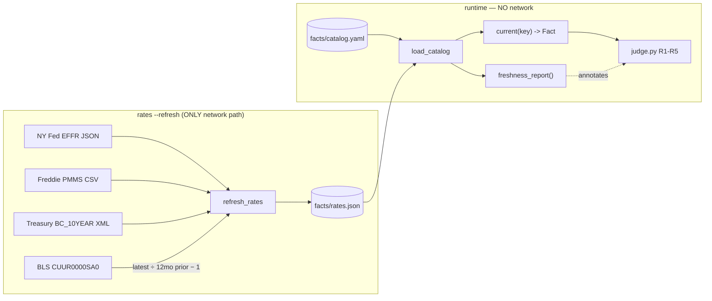

# feat: A-01 · Facts catalog + primary-fed rates table + freshness tests

## Goal Capsule

Give Almanac the facts it judges against: a 15-entity `facts/catalog.yaml` (11 human-sourced
statutory limits + 4 market rates), a `facts/rates.json` refreshed from primary feeds, and a
freshness layer that flags a stale feed **without** suppressing verdicts.

The load-bearing constraint: **the agent fills no value.** Every `source: manual` entry ships
`value: null` / `source_url: null`, and Zaeem supplies the numbers with irs.gov / ssa.gov /
treasurydirect.gov URLs. Tests fail on nulls and on URLs that don't 200.

---

## Problem Frame

A-00 proved the pipes work. A-01 decides what "true" means. Every verdict `judge.py` fires in
A-03+ resolves through `catalog.current(key)`, so a wrong value here is a wrong verdict on a
creator's video — the exact failure Almanac exists to prevent.

### The one design change from the issue text

HAC-37 specifies FMP for all four rates. **FMP cannot supply them on this key**, verified twice:

- `economic-indicators` returns a ~9-month-old window, and `from_date`/`to_date` are *ignored*
  (byte-identical response with and without them).
- `cpi_yoy` needs the latest month **and the same month a year earlier**. FMP returns **2 CPI
  rows, two months apart**. The pair does not exist.
- The issue's own `max_age_days` (mortgage 10 days, 10-year 5 days) would mark every rate
  permanently stale under that lag — the product would ship self-flagged.

HAC-37 §6 pre-authorises the fix: *"the four no-key primary feeds … fill the same table; the
runtime contract doesn't change."* All four were tested live and are current (ADR §9). Two match
the issue's own 9/7 figures **exactly** (EFFR 3.63, PMMS 6.71) where FMP does not — so those
figures were verified against the primary sources, not FMP.

This is strictly better provenance: `primary_source_url` was always going to point at NY Fed /
Freddie / Treasury / BLS. Now the value comes *from* there rather than from a vendor's copy of it.

---

## Requirements

| ID | Requirement | Source |
|---|---|---|
| R1 | `facts/catalog.yaml` holds ≥14 entities with the full field set | §1 |
| R2 | 11 required `manual` keys present, every one `value: null` + `source_url: null` | §1, §4 |
| R3 | 4 required `rates` keys present | §1 |
| R4 | Manual entries carry `history` (prior-year value + effective dates) | §1 |
| R5 | `rates --refresh` writes `{value, as_of, fetched_via, fetched_at, primary_source_url}` per key | §1 |
| R6 | `cpi_yoy` = latest month ÷ same month one year earlier − 1 | §1 |
| R7 | Runtime reads `facts/rates.json` only; no module but `catalog.refresh_rates()` hits the network | §1 |
| R8 | Per-key `max_age_days`: EFFR 45, mortgage 10, 10-year 5, CPI 45 | §1 |
| R9 | `freshness_report()` marks stale feeds; **verdicts still run** | §1 |
| R10 | `catalog.py` exposes `load_catalog()`, `current(key) -> Fact`, `freshness_report()` | §1 |
| R11 | `Fact` carries `resolved_from: manual\|rates` and `as_of` | §1 |
| R12 | `python -m almanac facts` prints key, value, as-of/effective, source | §1 |

---

## Key Technical Decisions

**KTD1 — Per-key fetcher seam.** `refresh_rates()` dispatches to one small function per key rather
than one FMP client. Swapping a source becomes a one-function change, so if a paid FMP key later
returns current rows, restoring the FMP path touches one fetcher — not the module.

**KTD2 — `fetched_via` records the actual fetcher.** The issue hardcodes `"fmp"`. Writing `"fmp"`
while reading NY Fed would be a false provenance claim in the very file whose purpose is
provenance. Values: `nyfed`, `freddiemac`, `treasury`, `bls`.

**KTD3 — Staleness degrades the label, never the verdict.** R9 is explicit. `freshness_report()`
returns per-key status; the report and UI render "as of `<date>` (stale feed)". `judge.py` is not
consulted about freshness and no rule is suppressed. A stale rate still produces a verdict — it
produces an *annotated* one.

**KTD4 — CPI YoY is computed in `refresh_rates()`, stored as a percent.** BLS returns an index
level (333.918). The catalog key is `cpi_yoy` with `unit: pct`, so the derivation happens once at
refresh and `rates.json` stores the percent. `as_of` is the latest month's date; the 12-months-prior
observation is recorded in `fetched_via` detail so the derivation is auditable.

**KTD5 — `history` is a list, not a single prior value.** The issue says "prior-year value +
effective dates". A list of `{value, effective_from, effective_to}` costs nothing now and is what
A-03's "was this true when the video was published?" question will need.

**KTD6 — URL-200 test is network-bound and marked.** R2's proof requires live 200s. That makes the
test suite network-dependent, so it gets a `@pytest.mark.network` marker and runs by default but is
deselectable — CI without egress can skip it rather than fail red.

---

## High-Level Technical Design



The dashed edge is KTD3: freshness annotates, it never gates.

---

## Implementation Units

### U1. `Fact` model and catalog schema types

**Goal:** One typed shape every consumer resolves through.
**Requirements:** R11
**Files:** `almanac/models.py`
**Approach:** Pydantic models — `CatalogEntry` (key, label, kind, source, unit, effective_from,
effective_to, source_url, max_age_days, value, history), `HistoryEntry`, `Fact` (key, label, value,
unit, as_of, resolved_from, source_url, stale: bool, max_age_days). `kind` and `source` and `unit`
are `Literal` enums so a typo in YAML fails at load, not at verdict time.
**Note:** `models.py` becomes protected after A-03, so get the shape right now.
**Test scenarios:** covered via U6's load tests — no standalone model tests.
**Verification:** `venv/bin/python -c "from almanac.models import Fact, CatalogEntry"` succeeds.

### U2. Rewrite `facts/catalog.yaml` to the A-01 schema

**Goal:** 15 entities, every manual value null, ready for Zaeem to fill.
**Requirements:** R1, R2, R3, R4, R8
**Files:** `facts/catalog.yaml`
**Approach:** Replace A-00's placeholder scaffold (different key names, no `history`). 11 manual:
`k401_employee_deferral`, `k401_catchup_50plus`, `ira_contribution`, `ira_catchup_50plus`,
`hsa_self_only`, `hsa_family`, `standard_deduction_single`, `standard_deduction_mfj`,
`ss_wage_base`, `gift_annual_exclusion`, `ibond_composite_rate`. 4 rates:
`fed_funds_effective`, `mortgage_30y_fixed`, `treasury_10y`, `cpi_yoy` with `max_age_days`
45 / 10 / 5 / 45 and their `primary_source_url` set to the human page.
Manual entries: `value: null`, `source_url: null`, `effective_from: null`, and a `history:` block
with one null-valued prior-year row so the shape is visible where Zaeem types.
**Execution note:** The agent fills nothing. A test asserts that.
**Test scenarios:** see U6.
**Verification:** `venv/bin/python -c "import yaml;d=yaml.safe_load(open('facts/catalog.yaml'));print(len(d['entities']))"` prints ≥14.

### U3. `catalog.py` — load, resolve, freshness

**Goal:** The read path every later module uses.
**Requirements:** R7, R9, R10, R11
**Dependencies:** U1, U2
**Files:** `almanac/catalog.py`
**Approach:** `load_catalog()` parses YAML into `CatalogEntry` objects and raises on an unknown
`kind`/`source`/`unit`. `current(key) -> Fact` resolves `source: manual` from the catalog and
`source: rates` from `facts/rates.json`, setting `resolved_from` and `as_of` accordingly, and
computing `stale` from `max_age_days` against `as_of`. `freshness_report()` returns a per-key
status list. **No network call anywhere in this module outside `refresh_rates()`** — a test asserts
it.
**Test scenarios:** see U6.
**Verification:** `venv/bin/python -c "from almanac.catalog import load_catalog, current, freshness_report; print(len(load_catalog()))"`.

### U4. `catalog.refresh_rates()` — four primary-feed fetchers

**Goal:** Fill `facts/rates.json` from the primary sources, with honest provenance.
**Requirements:** R5, R6, R7
**Dependencies:** U1
**Files:** `almanac/catalog.py`
**Approach:** Four small fetchers behind a dispatch dict (KTD1):

| key | source | extraction |
|---|---|---|
| `fed_funds_effective` | `markets.newyorkfed.org/api/rates/unsecured/effr/last/1.json` | `refRates[0].percentRate`, `effectiveDate` |
| `mortgage_30y_fixed` | `freddiemac.com/pmms/docs/PMMS_history.csv` | last row, `pmms30` column |
| `treasury_10y` | Treasury daily par yield XML, current year | newest `BC_10YEAR` + `NEW_DATE` |
| `cpi_yoy` | BLS v1 `CUUR0000SA0` | latest month ÷ same month prior year − 1, as percent |

Each writes `{value, as_of, fetched_via, fetched_at, primary_source_url}`. A fetcher that fails
leaves the **previous** entry intact and is reported — a refresh must never blank a good value with
a network blip. `fetched_at` is UTC ISO.
**Execution note:** Network-bound; proven by running it, not by mocking.
**Test scenarios:** see U6.
**Verification:** `venv/bin/python -m almanac rates --refresh` writes 4 non-null keys.

### U5. CLI — `python -m almanac facts` and `rates --refresh`

**Goal:** The two commands the proofs invoke.
**Requirements:** R5, R12
**Dependencies:** U3, U4
**Files:** `almanac/__main__.py`, `almanac/cli.py`
**Approach:** `__main__.py` delegates to `cli.main()` so `python -m almanac` works (A-00 never
created it). Subcommands via `argparse`: `facts` prints a table of key / current value / as-of or
effective date / source / stale-marker; `rates --refresh` calls `refresh_rates()` and prints what
changed. `facts` must run with `FMP_API_KEY` unset and make **zero** network calls (R7).
**Test scenarios:** see U6.
**Verification:** `env -u FMP_API_KEY venv/bin/python -m almanac facts` exits 0.

### U6. `tests/test_catalog.py` — the four required tests

**Goal:** The proof-5 suite.
**Requirements:** R2, R8, R9
**Dependencies:** U2, U3, U4
**Files:** `tests/test_catalog.py`, `pytest.ini`
**Approach:** Retire `tests/test_catalog_scaffold.py` (A-00's inverse assertion) and replace it —
its `test_agent_filled_no_manual_value` becomes this issue's null-value test with the polarity
flipped, per the plan's own A-00 note.
**Test scenarios:**
- **null-value:** every entity has a non-null `value`; every `manual` entity has a non-null
  `source_url` and `effective_from`. Fails loudly listing each null key. *(Red until Zaeem fills.)*
- **stale manual fact:** an entity whose `effective_from` is >13 months old with no `effective_to`
  is reported stale — catches a statutory limit that silently rolled over a new tax year.
- **rates max_age warn:** a `rates` entry whose `as_of` exceeds `max_age_days` sets `Fact.stale`
  **and** still returns a usable value (KTD3 — asserts the verdict is not suppressed).
- **url-200:** every manual `source_url` and every `primary_source_url` returns HTTP 200.
  `@pytest.mark.network`.
- **no-FMP:** with `FMP_API_KEY` unset, `current()` and `freshness_report()` resolve for all 15 keys
  and no outbound request is made — asserted by monkeypatching `requests.get` to raise.
- **kind/source/unit enums:** an unknown value fails at load.
**Verification:** `venv/bin/pytest tests/test_catalog.py -q`.

---

## Verification Contract

| Gate | Command |
|---|---|
| V1 | `venv/bin/python -c "from almanac.catalog import load_catalog, current, freshness_report"` |
| V2 | `venv/bin/python -m almanac rates --refresh` → 4 keys, non-null `value`/`as_of` |
| V3 | `env -u FMP_API_KEY venv/bin/python -m almanac facts` → exits 0, zero FMP calls |
| V4 | `venv/bin/pytest tests/ -q` → all pass (needs Zaeem's values) |
| V5 | `venv/bin/pytest tests/test_catalog.py -q -m network` → all URLs 200 |

**PROOF lines** (print + append to `docs/proofs/A-01.md`):

```
PROOF A-01: catalog loads, 14+ keys, 0 null values = PASS
PROOF A-01: every manual source_url and every primary_source_url returns HTTP 200 = PASS
PROOF A-01: rates --refresh writes 4 keys with non-null value/as_of; treasury_10y equals treasury.gov BC_10YEAR for the same date (manual spot check by Zaeem) = PASS
PROOF A-01: with FMP_API_KEY unset, scan/lint still run from facts/rates.json and print 0 network calls to FMP = PASS
PROOF A-01: pytest tests/test_catalog.py — null-value test, stale manual fact (>13 months, no effective_to) test, rates max_age warn test, url-200 test all PASS = PASS
```

### Two proof-wording notes

**Proof 3** says `treasury_10y` should equal treasury.gov's `BC_10YEAR` for the same date. Under
this plan the value is *read from* that XML, so the check is now tautological rather than
corroborating. The spot check is still yours to make, but the stronger version is: confirm the
number rendered in `facts/rates.json` matches what treasury.gov shows in the browser.

**Proof 4** names `scan`/`lint`, which do not exist until A-03. What A-01 can prove is the
runtime-read contract itself: `almanac facts` resolves all 15 keys with `FMP_API_KEY` unset and
zero network calls, enforced by a test that makes `requests.get` raise. `scan`/`lint` inherit that
contract by construction when they land. Flagging rather than silently redefining the proof.

---

## Definition of Done

- [ ] `facts/catalog.yaml` has 15 entities; agent filled zero values.
- [ ] Zaeem filled 11 manual values + `source_url` + `effective_from` + `history`.
- [ ] V1–V5 pass.
- [ ] All five PROOF lines PASS, printed and appended to `docs/proofs/A-01.md`.
- [ ] ADR-000 §9's open question resolved or explicitly carried forward.
- [ ] Walkthrough artifact produced.

---

## Blocking Dependency (Zaeem, ~20 min)

Everything except the null-value and url-200 proofs can be finished without you. Those two need
**11 keys × (2026 value + 2025 history + primary-source URL)**. I will not fill, guess, or recall
any of them.

I'll scaffold the YAML so it's a fill-in-the-blanks exercise, and hand you the exact block.

---

## Risks

| Risk | Mitigation |
|---|---|
| Freddie Mac / BLS block a scripted `User-Agent` or rate-limit | All four tested live and returned 200 with a plain UA. A fetcher failure preserves the prior value and reports (U4). |
| BLS v1 is keyless but rate-limited (25 req/day) | `rates --refresh` runs once nightly; well inside the cap. |
| `cpi_yoy` derivation silently wrong | The 12-month-prior observation is recorded alongside, so the arithmetic is auditable from `rates.json` alone. |
| A-00's `catalog.yaml` key names differ from A-01's | U2 rewrites it wholesale; all values were null, so nothing human-supplied is lost. |
| Statutory limit rolls over mid-demo | The >13-month stale-manual test is exactly this alarm. |
